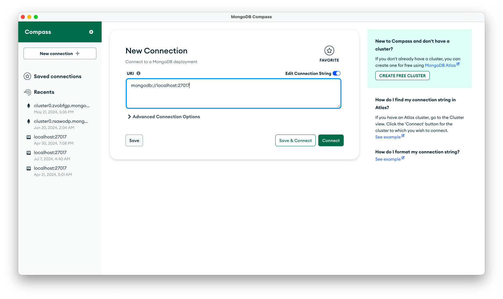
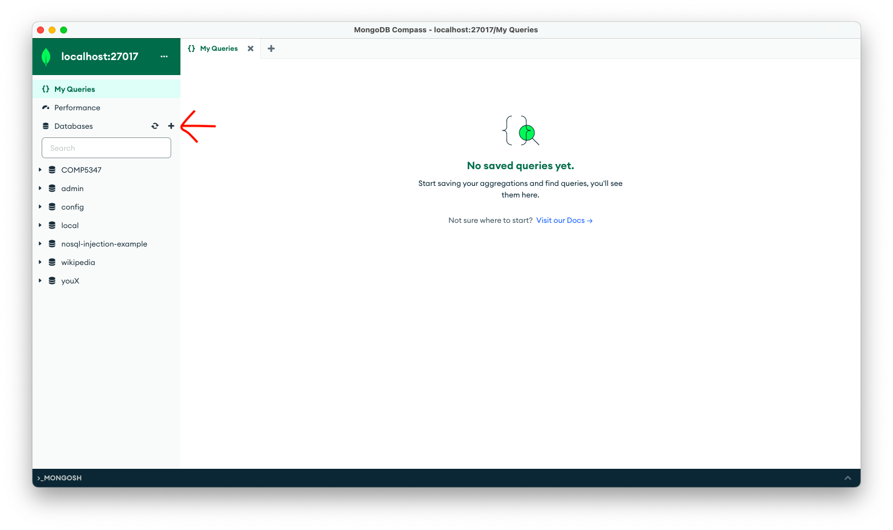
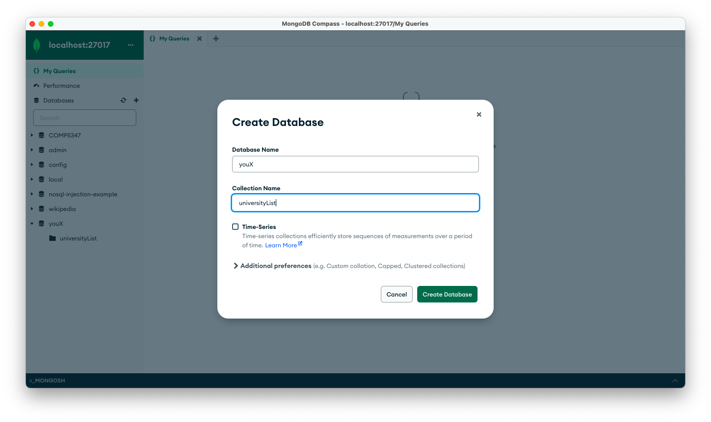
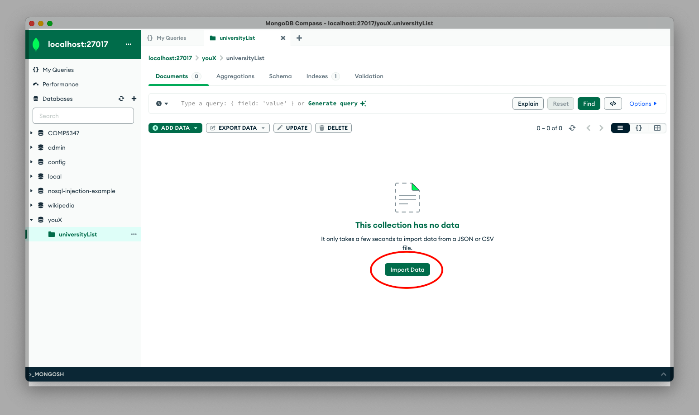

# youX Assessment
This is a web development assessment from youX.

## How to Run
1. Turn on MongoDB Compass and connect to **mongodb://localhost:27017**. 
2. Create a new database by clicking **+**, then use **youX** for database name and **universityList** for collection name. 
3. After creating database, importing data from *data.json*. 
4. Turn on two different terminal windows for running backend and frontend simultaneously.
5. Use one of the terminal to navigate to the ***backend*** folder and run `npm i` to install all dependencies, then run `node app.js` to run the server and connect to the database.
6. Use another terminal window and navigate to the ***frontend*** folder and run  `npm i`  to install all dependencies, then run "npm start" to render the frontend.
7. Ensure that MongoDB Compass connects to the correct url.